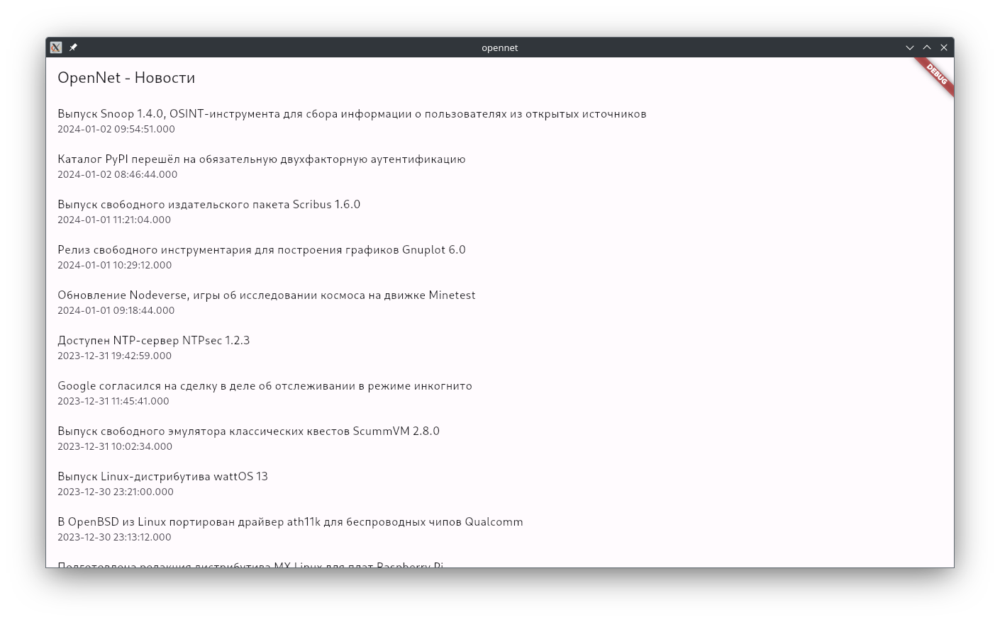
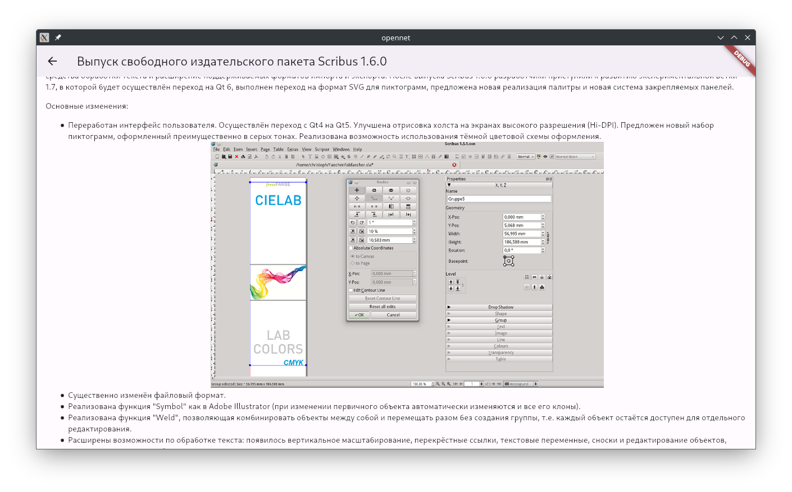

# OpenNet News Reader

Простое Flutter-приложение для чтения новостей с портала OpenNet.




## Как начать

### Зависимости

Перед началом установки убедитесь, что у вас установлены следующие инструменты:

- [Flutter](https://flutter.dev/docs/get-started/install)
- [Dart](https://dart.dev/get-dart)

### Установка

1. Склонируйте репозиторий:

```bash
git clone https://github.com/lencodigitexer/opennet.git
```

2. Перейдите в директорию проекта:

```bash
cd opennet
```

3. Установите зависимости:

```bash
flutter pub get
```

### Запуск

```bash
flutter run
```